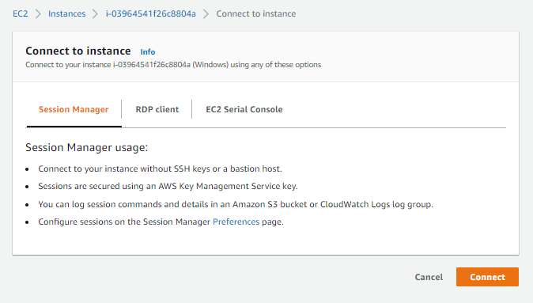

## Lab 07: Installing Terraform on a Windows Server

In this lab, we'll be using Powershell to install Terraform on a Windows Server. Before we start, make sure to [launch a Windows Server through the AWS Console](https://docs.aws.amazon.com/AWSEC2/latest/WindowsGuide/EC2_GetStarted.html).

<p align="center">
    
</p>

Once your Windows instance is up and running, select it and hit **Connect**. Choose the Session Manager and click **Connect.**

   
  

It should open a Powershell terminal in a new tab. Create a new directory where the Terraform binary will be saved.

```bash
mkdir C:\terraform
cd C:\terraform
```

Download the binary zip file and then extract the binary. Remove the zip once the binary is extracted.

```bash
Invoke-WebRequest -Uri https://releases.hashicorp.com/terraform/0.13.4/terraform_0.13.4_windows_amd64.zip -outfile terraform_0.13.4_windows_amd64.zip 
```
```bash
Expand-Archive -Path .\terraform_0.13.4_windows_amd64.zip -DestinationPath .\
```
```bash
rm .\terraform_0.13.4_windows_amd64.zip -Force 
```

To ensure Terraform commands are read when we execute them, we need to add the Terraform binary to the PATH variable. Make sure to update the current session with the newly added variable.

```bash
setx PATH "$env:path;C:\terraform" -m 
```
```bash
$env:Path = [System.Environment]::GetEnvironmentVariable("Path","Machine") + ";" + [System.Environment]::GetEnvironmentVariable("Path","User")  
```

Verify the version installed. 

```bash
terraform version
```